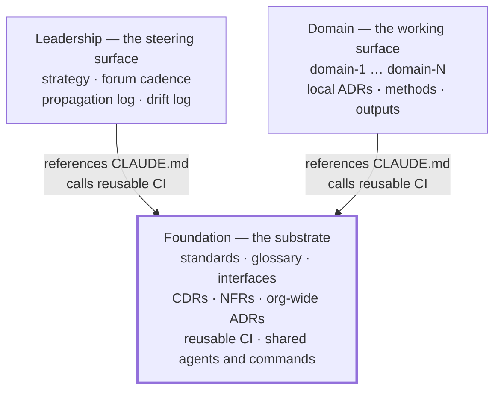
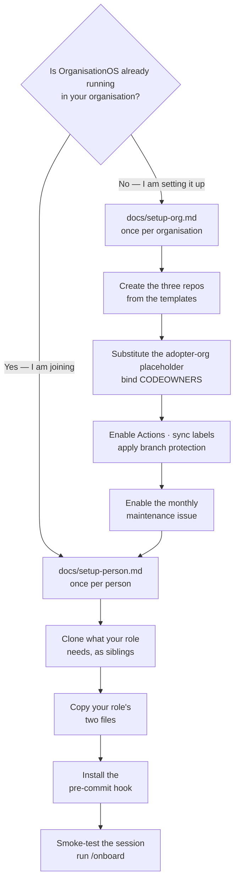

# OrganisationOS — Foundation

**The substrate repo of an OrganisationOS three-repo set.** OrganisationOS is a harness for human↔AI-agent collaboration in a knowledge-work organisation: three Git repositories, a small set of conventions, and CI that keeps them honest. Foundation holds what every session in the organisation shares — standards, glossary, interfaces, cross-domain decisions, NFRs, org-wide ADRs, the reusable CI, and the shared agent commands. A change here propagates organisation-wide. The Leadership and Domain repos depend on this one; it depends on neither.

## The three repos



| Repo | Holds | |
| --- | --- | --- |
| **Foundation** | Shared standards, decisions, CI and tooling | **You are here** |
| **Leadership** | Strategy, Forum cadence, propagation log, drift log | [organisationos-leadership](https://github.com/<adopter-org>/organisationos-leadership) |
| **Domain** | Per-domain working content | [organisationos-domain](https://github.com/<adopter-org>/organisationos-domain) |

On disk the three are siblings under one parent folder. The layout is load-bearing: every cross-repo path in the harness is written `../organisationos-foundation/…`, and the settings that give a session reach into Foundation name that exact path. Nest them inside another project or Git repository and those paths break, silently — see [docs/loading-model.md](docs/loading-model.md).

```text
~/projects/<adopter-org>/
  organisationos-foundation/     ← this repo
  organisationos-leadership/
  organisationos-domain/         ← or one per domain if split
```

## Where do I start?



- **Setting OrganisationOS up for an organisation** — [docs/setup-org.md](docs/setup-org.md). About two hours, done once by the person who will be Admin.
- **Joining an organisation that already runs it** — [docs/setup-person.md](docs/setup-person.md). About thirty minutes.
- **Understanding it first** — [docs/concepts.md](docs/concepts.md) for the model, roles and how a decision travels; [docs/loading-model.md](docs/loading-model.md) for what an agent session actually loads from the other repos.

## What lives here

| Path | Contents |
| --- | --- |
| `standards/` | Templates (ADR, CDR, interface, handover, …), the banned-pattern list, coverage gaps |
| `glossary.md` | Terms used across two or more domains |
| `interfaces/` | Cross-domain interface contracts |
| `cross-domain-decisions/` | CDRs — decisions that affected more than one domain |
| `nfrs/` | Non-functional requirements applying org-wide |
| `architectural-decisions/` | ADRs with org-wide or cross-domain scope |
| `syntheses/` | Cross-domain read-only syntheses |
| `references/patterns/` | Optional methodologies adopters may layer on |
| `docs/` | Concepts, loading model, the two setup guides |
| `.github/workflows/` | Reusable (`workflow_call`) CI called by Leadership and Domain, pinned at `@v1` |
| `.github/agents/` | Cross-vendor agent definitions (Copilot-CLI-native source of truth) |
| `.claude/agents/` | Claude Code mirror of the same agents |
| `.github/hooks/` | The banned-string pre-commit hook |
| `.claude/commands/` | Shared slash commands: `/onboard`, `/update-wiki`, `/find-relevant-knowledge`, `/raise-cdr`, `/drift-check`, `/promotion-candidate` |
| `.claude/skills/` | Shared skills |

**Not here:** per-domain working content (Domain repo), strategy and Forum cadence (Leadership repo), the steward's drift log (Leadership repo).

## Repository structure

```text
organisationos-foundation/
  README.md                        ← this file
  CLAUDE.md                        ← substrate rules; the sibling repos reference this file
  AGENTS.md                        ← cross-vendor agent baseline
  FORMATS.md                       ← format whitelist (canonical copy)
  CHANGELOG.md                     ← one line per merged substrate change
  glossary.md
  docs/
    concepts.md  loading-model.md  setup-org.md  setup-person.md
    assets/banner.png
  standards/
    templates/                     ← adr, cdr, cdr-light, interface, handover, change-proposal, …
    templates/onboarding/          ← one settings.local.json + CLAUDE.local.md pair per role
    banned-patterns.yml
    coverage-gaps.md
  interfaces/  cross-domain-decisions/  nfrs/  architectural-decisions/  syntheses/
  references/patterns/
  .github/
    CODEOWNERS  PULL_REQUEST_TEMPLATE.md  ISSUE_TEMPLATE/  labels.yml
    workflows/                     ← reusable CI + self-ci.yml (runs them on Foundation's own PRs)
    hooks/  agents/
  .claude/
    commands/  skills/  agents/  settings.json
```

## Worked example — GreenLeaf Research Lab

GreenLeaf runs four domains: **research**, **operations**, **fundraising** and **compliance**, each with a Domain Lead, plus one Leader and one Admin.

A researcher proposes a shared anonymisation standard — how identifying details are removed from datasets before they enter any domain's working folder. Research produces the data, operations stores it, compliance signs off, fundraising cites the outcomes: a cross-domain concern. The researcher drafts a CDR from `standards/templates/cdr-template.md` and opens a PR here. `structure-check` confirms the CDR follows the template; `checklist-complete` confirms the Approval checklist is filled in. One Leader and the Domain Leads of research, operations and compliance review. On merge, the Admin records the propagation in Leadership's `cadence/propagation-log.md` and opens implementation PRs for the three affected domains in the Domain repo; each Domain Lead merges their own.

The full circuit, drawn, is in [docs/concepts.md](docs/concepts.md#how-a-decision-travels).

## Further reading

- [`FORMATS.md`](FORMATS.md) — what lives in Git and what is referenced from elsewhere
- [`CHANGELOG.md`](CHANGELOG.md) — the announcement surface for merged substrate changes
- [`references/patterns/`](references/patterns/README.md) — Wardley mapping, Team Topologies, OKRs, flow engineering, opportunity-solution trees
- [`.claude/agents/README.md`](.claude/agents/README.md) — how the agent definitions are mirrored across vendors

These templates originate from [2SSilver/organisationos-foundation](https://github.com/2SSilver/organisationos-foundation), MIT licensed. They were built from an internal design specification; nothing in that specification is required to operate the repos.
