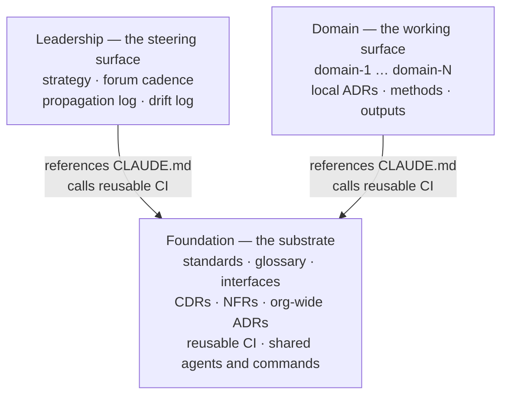
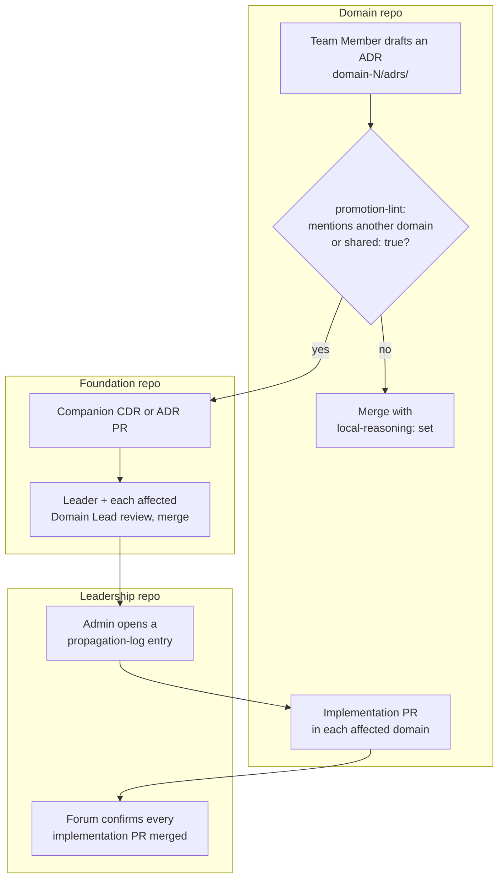

# OrganisationOS — concepts

OrganisationOS is a harness for human↔AI-agent collaboration in a knowledge-work organisation: three Git repositories, a small set of conventions, and CI that keeps them honest. It has strong defaults for the collaboration surface — where things live, who reviews what, what an agent session loads — and no opinion about the work itself.

## Why three repos

| Repo | Holds | Who commits | A change here… |
| --- | --- | --- | --- |
| **Foundation** | Standards, glossary, interfaces, cross-domain decisions (CDRs), NFRs, org-wide ADRs, reusable CI, shared agents and commands | Admin and Leader, with affected Domain Leads on cross-domain artefacts | …propagates to every domain |
| **Leadership** | Strategy, Leadership Forum minutes, the propagation log, the steward's drift log | Leaders and the Admin | …steers, but does not change any domain's working content |
| **Domain** | One folder per domain: local ADRs, methods, drafts, outputs, a domain glossary, references to live artefacts | Everyone in that domain | …stays inside the domain unless it is promoted |

Dependency runs one way. Leadership and Domain build on Foundation's rules and call Foundation's CI; Foundation depends on neither. Splitting them keeps the blast radius of a change visible: a PR in Foundation is an organisation-wide change and is reviewed like one; a PR inside `domain-3/` is that domain's business.



On disk the three are sibling folders under one parent. That layout is load-bearing: every cross-repo path in the harness is written as `../organisationos-foundation/…`, and the settings that give a session reach into Foundation name that exact relative path. Nest the repos anywhere else and those paths break, silently. See [How a session loads the three repos](loading-model.md).

```text
~/projects/<adopter-org>/
  organisationos-foundation/
  organisationos-leadership/
  organisationos-domain/          ← or one per domain if split
```

## The five roles

Role labels are defaults; adopters rename them to fit their culture. The five functions are what travel.

- **Product Owner** — owns *what the domain offers*. Drafts and revises the domain's outward-facing artefacts: offerings, roadmap items, intake patterns.
- **Team Member** — owns *how the work is done*. Commits methods, notes and analyses. Reviews changes to outputs that depend on execution detail.
- **Domain Lead** — owns the domain's quality bar. Maintains the domain's `CLAUDE.md`, glossary and review rules; arbitrates between Product Owner and Team Member; is a required reviewer on any cross-domain decision that touches the domain.
- **Leader** — owns cross-domain alignment and strategy. Chairs the Leadership Forum, approves CDRs, co-signs harness changes. Does not commit inside any single domain.
- **Admin** — owns the operating contract. Two functions, one person in a small organisation, split at scale: **Steward** (drift log, propagation tracking, the monthly maintenance issue, banned-pattern list, format gate, template retirement) and **Engineer** (the improvement loop — new skills, tighter CI rules, better templates).

People who read the harness without committing — Operations, Finance, Legal, customers — are *consumers*. They are listed as stakeholders in a domain's README and need no role binding.

**One person, several hats.** At 20–50 people one human often holds two or three roles. That is allowed, with one rule: **no single human satisfies two required-reviewer slots on the same PR.** When a role-holder is also the proposer, the slot escalates one step up (Product Owner → Domain Lead → Leader). Where the organisation is too small for the escalation to land on a distinct person, a named alternate countersigns — CODEOWNERS in each repo lists the fallback owners so a valid approver always exists.

**Admin at scale.** Up to roughly 50 people, one Admin wears both hats (about 0.3 FTE). Beyond that, stewardship distributes to per-domain stewards chaired by a lead Admin; the Engineer function stays singular so the improvement loop keeps one voice.

## Two gates, not one

**A human gates the publish.** Every artefact that leaves a draft state — a merged PR, a committed output, a cross-domain decision — passes a named human: the Admin on harness changes, the Leader on cross-domain decisions and strategy, the Product Owner on domain outputs, the Domain Lead on review rules.

**A human gates high-risk tool calls.** The publish gate is necessary but not sufficient: an agent reading external content can be steered into a destructive action before any publish moment. Each repo's `.claude/settings.json` ships a permissions block that does the part a committed file can do. It allow-lists `Read(**)` across the workspace; it allow-lists Edit and Write against that repo's own substrate folders, and Edit alone on its root `CLAUDE.md`; and it denies Write into the sibling repos' paths. A session can therefore read across the three-repo set and write only inside its own. What the file does not encode is the rest of the tool gate: destructive calls are approved one at a time by the operator, which is session behaviour rather than committed configuration.

## How a decision travels



A decision starts where the work is. A Team Member drafts an ADR in their domain. If the ADR mentions another domain, or is marked `shared: true`, the `promotion-lint` check asks the author to choose: keep it local and say why (`local-reasoning:`), or promote it by opening a companion PR in Foundation and pointing at it (`promoted-to:`). The Foundation PR is reviewed by a Leader and the Domain Lead of every affected domain. When it merges, the Admin records a propagation-log entry in Leadership and opens an implementation PR in each affected domain; each Domain Lead merges their own. The cycle closes when the Leadership Forum sees every implementation PR merged and marks the log entry complete.

**Worked example — GreenLeaf Research Lab.** GreenLeaf runs four domains: research, operations, fundraising, compliance. A researcher proposes a shared anonymisation standard for datasets before publication. Research produces the data, operations stores it, compliance signs off, fundraising cites the outcomes — a cross-domain concern. The researcher drafts a CDR from `standards/templates/cdr-template.md` and opens a PR in Foundation. Foundation's `structure-check` confirms the CDR follows the template; `checklist-complete` confirms the Approval checklist is filled in. One Leader and the Domain Leads of research, operations and compliance review. On merge the Admin logs the propagation in Leadership's `cadence/propagation-log.md` and opens three implementation PRs in the Domain repo. The standard now lives in `standards/`, is referenced by domain ADRs, and is enforced by the banned-string check.

## What lives where

| Artefact | Repo and path |
| --- | --- |
| Cross-domain decision (CDR) | Foundation `cross-domain-decisions/` |
| Org-wide architectural decision | Foundation `architectural-decisions/` |
| Domain-local architectural decision | Domain `domain-N/adrs/` |
| Interface contract between two domains | Foundation `interfaces/` |
| Non-functional requirement (org-wide) | Foundation `nfrs/` |
| Term used by two or more domains | Foundation `glossary.md` |
| Term unique to one domain | Domain `domain-N/glossary.md` |
| Template (ADR, CDR, interface, handover, …) | Foundation `standards/templates/` |
| Banned identifying patterns | Foundation `standards/banned-patterns.yml` |
| Format whitelist | `FORMATS.md` (canonical in Foundation, mirrored in the other two) |
| Strategy, OKRs, position papers | Leadership `strategy/` |
| Leadership Forum minutes, propagation log | Leadership `cadence/` |
| Drift log, skill registry, Admin handover | Leadership `steward/` |
| Short-lived drafts (14-day shelf life) | Domain `domain-N/_drafts/` |
| Pointers to live external artefacts | Domain `domain-N/references.md` |
| Cross-domain read-only synthesis | Foundation `syntheses/` |

## Further reading

- [How a session loads the three repos](loading-model.md) — what actually enters an agent's context, and what silently does not
- [Setting up for an organisation](setup-org.md) · [Joining an organisation that runs this](setup-person.md)
- [`FORMATS.md`](../FORMATS.md) — what lives in Git and what is referenced from elsewhere
- [`references/patterns/`](../references/patterns/README.md) — optional methodologies (Wardley mapping, Team Topologies, OKRs, …) adopters may layer on
