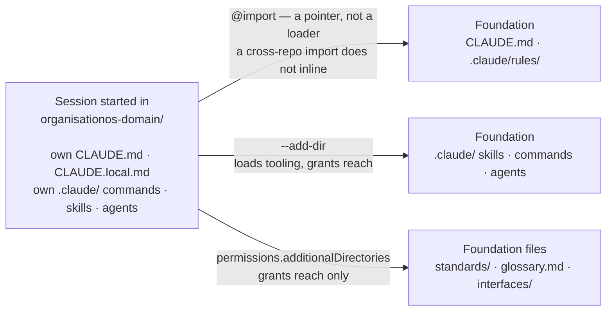

# How a session loads the three repos

A session started in one repo can reach the other two in three different ways. They look similar in configuration, they behave differently, and none of them does what the phrase "Foundation's rules are loaded" implies.

This matters because every failure here is silent. The session starts, nothing errors, and rules the operator believes are active were never in context.

## The three mechanisms

| Mechanism | Files readable | `.claude/skills/` | `.claude/commands/`, `.claude/agents/` | The other repo's `CLAUDE.md` rules |
| --- | --- | --- | --- | --- |
| `@../organisationos-foundation/CLAUDE.md` inside a `CLAUDE.md` | — | — | — | **No.** A cross-repo import does not inline its target. An import of a file inside the same project does. Neither case emits an error. |
| `claude --add-dir ../organisationos-foundation` (or `/add-dir` mid-session) | Yes | Yes, with live reload | Yes, without live reload; the project's own command wins a name clash | No — but it grants the reach that lets the agent read them on request |
| `"permissions": { "additionalDirectories": [...] }` in `settings.local.json` | Yes | No | No | No — but it grants that same reach |

## Reach is not loading

Foundation's rules do not arrive on their own. Reach is necessary and not sufficient: the settings above let a session read Foundation, and the substrate enters context only when something retrieves it — you asking for it, or the `find-relevant-knowledge` command going and getting it.

A rule that must hold in **every** session therefore cannot live only in Foundation. That is why the Domain and Leadership `CLAUDE.md` files restate the confidentiality boundary in their own words instead of pointing at Foundation for it. Restating a rule in two places is normally a smell; here it is the only thing that makes the rule real.

The `@import` line at the top of those files is still worth keeping. It documents the dependency, and it is how a reader learns where the substrate lives. It is a pointer, not a loading mechanism, and no wording in this harness should suggest otherwise.

The environment variable `CLAUDE_CODE_ADDITIONAL_DIRECTORIES_CLAUDE_MD=1` governs whether a directory added with `--add-dir` contributes its own `CLAUDE.md` and `.claude/rules/` — a different question from whether an explicit `@import` resolves. Inside the three-repo set nothing depends on it.

## What to do about it

- **Clone the three repos as siblings, with the exact names.** Every cross-repo path in the harness is written `../organisationos-foundation/…` (or `../../` from inside a domain folder). Nest them anywhere else and those paths break without complaint.
- **Set `additionalDirectories` from your role's file** in `standards/templates/onboarding/`, not from a repo-root `settings.local.json.example` — those examples ship with an empty list, which starts a session that reports nothing and reaches nothing.
- **Start sessions with `--add-dir ../organisationos-foundation`** when you want Foundation's shared commands (`/onboard`, `/update-wiki`, `/find-relevant-knowledge`, `/raise-cdr`) and agents. `additionalDirectories` alone does not bring those.
- **Retrieve before drafting.** Run `find-relevant-knowledge` against the folders you are about to touch. Reach without retrieval leaves the substrate on disk.

## The smoke test

A wrong install is silent, so test it. Start a session in the folder you actually work from and ask:

> Read Foundation's CLAUDE.md and tell me what the format policy says about built outputs such as decks.

The answer should be that built outputs are referenced from a domain's `references.md` rather than committed, per `FORMATS.md`.

A correct answer proves this session can **reach** Foundation and read it. It does not prove Foundation's rules are already in context — nothing puts them there automatically. If the answer is wrong, or the session says it cannot find or access the file, stop and fix two things before doing any work: that `../organisationos-foundation/` really is a sibling of the repo you launched in, and that your `.claude/settings.local.json` lists it under `additionalDirectories`.

Mechanism behaviour verified against Claude Code on 2026-08-26, by running the three configurations above and comparing an in-project import against a cross-repo one in the same file.

## Further reading

- [Setting up OrganisationOS for an organisation](setup-org.md) — the once-per-organisation path; its Step 3 is where the clone layout above gets established
- [Joining an organisation that runs OrganisationOS](setup-person.md) — the once-per-person path, including your role's `additionalDirectories` file and the smoke test above in context
- [OrganisationOS — concepts](concepts.md) — the three-repo model, the roles, and how a decision travels
