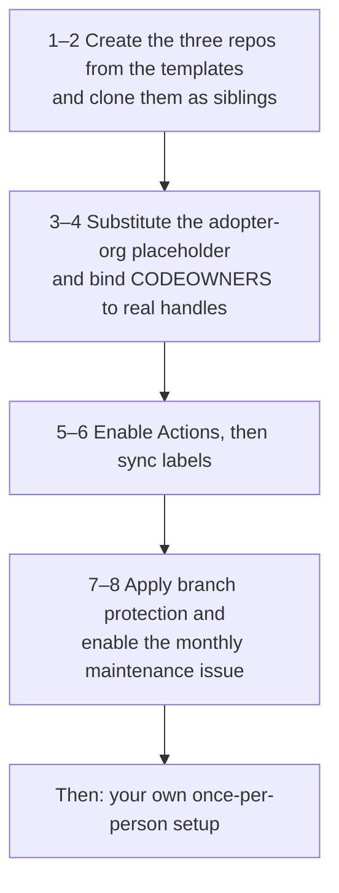

# Setting up OrganisationOS for an organisation

This is the once-per-organisation path. One person — usually the person who will be Admin — does it, once. Everyone else, including that person afterwards, follows [Joining an organisation that runs OrganisationOS](setup-person.md).

Budget about two hours. You need: a GitHub organisation (or user account) that will own the three repos, admin rights on it, and the `gh` CLI logged in.



## Step 1 — Create the three repos

Each template repo has a **Use this template** button. Create all three into the same owner, keeping the names:

```bash
ORG=your-github-org        # the owner that will hold the three repos
for r in foundation leadership domain; do
  gh repo create "$ORG/organisationos-$r" --template "2SSilver/organisationos-$r" --private
done
```

Public or private is your call. Foundation's reusable workflows are called cross-repo from Leadership and Domain, which works for private repos in the same organisation.

## Step 2 — Clone them as siblings

```bash
mkdir -p ~/projects/$ORG && cd ~/projects/$ORG
for r in foundation leadership domain; do gh repo clone "$ORG/organisationos-$r"; done
```

Do not nest them inside another project or Git repository. Every cross-repo path in the harness is written `../organisationos-foundation/…`, and the settings that give a session reach into Foundation name that exact path — a different layout breaks them, silently. See [How a session loads the three repos](loading-model.md).

## Step 3 — Substitute the placeholder

The templates carry the literal string `<adopter-org>` wherever they need to name your GitHub owner: in every workflow that calls a Foundation reusable, in `AGENTS.md`, and in the cross-repo links in each README. Until it is substituted, those workflows are invalid and those links are dead.

```bash
cd ~/projects/$ORG
for r in foundation leadership domain; do
  grep -rl '<adopter-org>' "organisationos-$r" --exclude-dir=.git | xargs perl -pi -e "s/<adopter-org>/$ORG/g"
  echo "$r: $(grep -rl '<adopter-org>' organisationos-$r --exclude-dir=.git | wc -l) files still carry the placeholder (expect 0)"
done
```

Commit and push in each repo. The `~/projects/<adopter-org>/` folder trees drawn in the READMEs are illustrations and are left as they are by this sweep only if you prefer — they are prose, not configuration.

## Step 4 — Bind CODEOWNERS

Each repo's `.github/CODEOWNERS` names `@placeholder-admin`, `@placeholder-leader` and `@placeholder-domain-N-lead`. Replace them with real GitHub handles in all three repos. These handles appear only in CODEOWNERS.

```bash
grep -rn 'placeholder-' organisationos-*/.github/CODEOWNERS
```

Leave the Domain repo's `domain-1/` … `domain-4/` folders as they are for now; renaming domains is a Domain-repo task and is described in that repo's README.

## Step 5 — Enable Actions

Actions are disabled on the published Leadership and Domain templates precisely because Step 3 has not run on them. Now that it has, enable them: **Settings → Actions → General → Allow all actions and reusable workflows** in each of the three repos, and under **Workflow permissions** confirm *Read repository contents and packages permissions* (the workflows that need more request it per job).

Foundation's own CI (`self-ci.yml`) runs on pull requests only. Pushing to `main` produces no run; that is expected.

## Step 6 — Sync labels

The label taxonomy ships as `.github/labels.yml` in every repo with a `label-sync` workflow that applies it. Run it once per repo; it is idempotent.

```bash
for r in foundation leadership domain; do gh workflow run label-sync.yml -R "$ORG/organisationos-$r"; done
```

Two workflows depend on labels existing: `back-flow-rules` (the `back-flow` label is its signal) and the monthly maintenance issue in Step 8 (`drift`, `harness`). Run this step before either can fire.

## Step 7 — Branch protection

CODEOWNERS says who *should* review. Branch protection is what turns that into a gate — GitHub satisfies a CODEOWNERS rule with one approval from any listed owner unless protection says otherwise. Apply these settings to `main` in each repo.

| Repo | Required approvals | Require review from Code Owners | Dismiss stale approvals | Require branch up to date |
| --- | --- | --- | --- | --- |
| Foundation | 2 | on | on | on |
| Leadership | 1 | on | on | on |
| Domain | 1 | on | on | on |

GitHub never counts the PR author's own approval, which is the "proposer cannot approve" rule the harness relies on.

```bash
protect () {   # protect <repo> <approvals>
  gh api -X PUT "repos/$ORG/$1/branches/main/protection" --input - <<JSON
{
  "required_status_checks": { "strict": true, "contexts": [] },
  "enforce_admins": false,
  "required_pull_request_reviews": {
    "dismiss_stale_reviews": true,
    "require_code_owner_reviews": true,
    "required_approving_review_count": $2
  },
  "restrictions": null
}
JSON
}
protect organisationos-foundation 2
protect organisationos-leadership 1
protect organisationos-domain 1
```

**What this does and does not enforce.** Foundation's two-approver floor covers every substrate path — standards, interfaces, CDRs, NFRs, workflows, `.claude/`. Inside the Domain repo, the harness distinguishes a *notification-only* tier (a Domain Lead sees `domain-N/glossary.md` and `_drafts/` changes but does not block them) from a *single-reviewer* tier (everything else in the domain). GitHub branch protection is per-branch, not per-path, so it cannot express that distinction natively. The Domain repo therefore runs at the single-reviewer floor, and the notification-only tier is a convention: Domain Leads approve glossary and draft PRs promptly rather than reading them closely. The CODEOWNERS comments say which paths are which. If your organisation needs the tiers enforced, GitHub rulesets with path conditions are the place to look; the harness does not ship them.

What you lose if you skip this step: every reviewer-set rule in the harness becomes advisory. A single listed owner — or nobody, if code-owner review is off — can merge a change to `standards/` that every domain then inherits.

## Step 8 — The monthly maintenance issue

On the 1st of every month, the Admin walks a checklist: stale `CLAUDE.md` files, stale interfaces, stalled propagations, accumulated drafts, the banned-pattern list, plugin pins. The checklist is `.github/ISSUE_TEMPLATE/monthly-dri.md` in the Leadership repo. A scheduled workflow in Leadership opens it as an issue and assigns it — but only once you tell it who the Admin is.

```bash
gh variable set ADMIN_HANDLE --body "the-admins-github-handle" -R "$ORG/organisationos-leadership"
gh workflow run monthly-dri.yml -R "$ORG/organisationos-leadership"     # open this month's issue now, as a test
gh issue list -R "$ORG/organisationos-leadership" --label drift
```

Expected: one open issue titled `Monthly maintenance check — YYYY-MM`, labelled `drift` and `harness`, assigned to the Admin. Re-running the workflow in the same month does nothing — it checks for an existing issue first. If the run fails with *could not add label*, Step 6 has not completed for Leadership.

The drift log, the skill registry and the Admin handover are all downstream of this one issue. If it does not open, the maintenance layer quietly stops.

## Step 9 — Install the pre-commit hook on this clone set

The banned-string pre-commit hook ships in Foundation only. Install it in each clone:

```bash
for r in foundation leadership domain; do
  cp organisationos-foundation/.github/hooks/banned-string-pre-commit "organisationos-$r/.git/hooks/pre-commit"
  chmod +x "organisationos-$r/.git/hooks/pre-commit"
done
```

## Step 10 — Now set yourself up as a person

You are also a user of the harness. Continue with [Joining an organisation that runs OrganisationOS](setup-person.md), which covers your role's `settings.local.json`, your `CLAUDE.local.md`, and the smoke test that proves Foundation's rules actually load in your sessions.

## Afterwards

- **Pinning.** Every Leadership and Domain workflow calls Foundation's reusables at `@v1`. When Foundation's workflows change, roll the `v1` tag forward in a Foundation PR (two approvers) — callers pick the change up on their next run.
- **Adding a domain.** Copy `domain-1/` to `domain-5/` in the Domain repo, add the Domain Lead to CODEOWNERS in Domain *and* Foundation, and add the domain to Foundation's `glossary.md` under `## Domains`.
- **Pattern A or Pattern B.** If your organisation has confidential external work outside the harness (consultancies, agencies), you are Pattern A: keep the banned-string check and the back-flow review. If the harness *is* the working repo (research groups, internal teams), you are Pattern B: `standards/banned-patterns.yml` may stay empty and the `back-flow-rules` workflow can be pointed at no paths via its `knowledge-paths` input.
